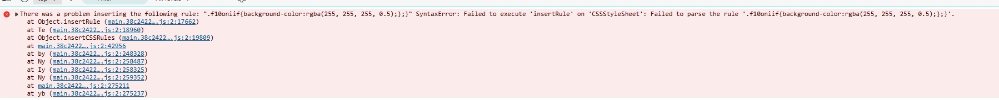

# griffel-error-demo
The purpose of this demo is to reproduce a specific error encountered when using the Griffel library after updating the Edge browser to version 129.0.279.52.

## Bug description
We are experiencing an issue where certain CSS styles are not functioning correctly in our web application after updating the Edge browser to version 129.0.279.52. We have identified a “SyntaxError” occurring when calling insertRule(). The error appears to be caused by a CSS rule with multiple closing braces, such as “.f143d684{width:calc(100% - 6.9rem);};}”.

## System information

Edge: 129.0.279.52
@griffel/react: 1.5.25

## Possible reasons
We suspect that this issue is due to an update in the Edge browser’s JavaScript engine, which results in the incorrect parsing of the JavaScript file. Disabling the “reduce_vars” feature of uglify-js resolves the issue.

## Reproduce steps

1. Build the project by running `npm run build`.
2. Open `index.html` in the `dist` folder using Edge version 129.0.279.52 or higher.
3. You will see the following error in the console. If the error does not appear immediately, try refreshing the page.

